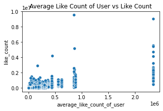
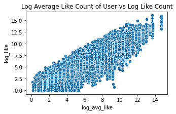
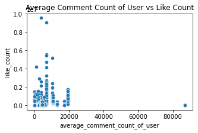
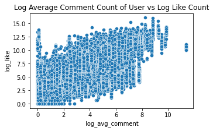
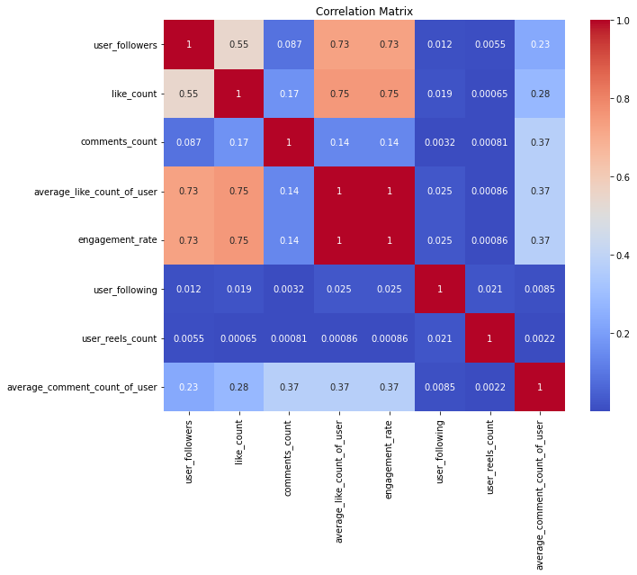
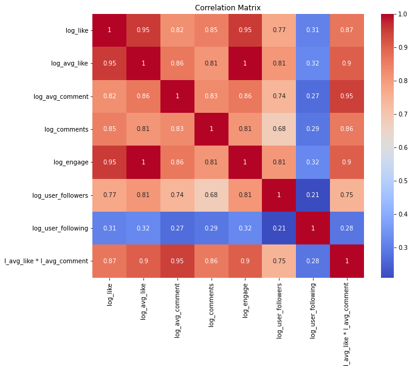

# Influencer Classification and Like Count Prediction

## Group Members
- Mert Tokgöz 30682
- Berat Karataşoğlu 30576
- Cemal Ulaş Erdoğan 30848

## Table of Contents
- [Introduction](#introduction)
- [Features](#features)
- [Project Workflow](#project-workflow)
- [Dependencies](#dependencies)
- [Conclusion](#conclusion)

---

## Introduction

This project focuses on analyzing Instagram data for two primary objectives:
1. **Influencer Classification**: Categorizing Instagram profiles into predefined types such as art, gaming, or fashion, based on profile features and post captions.
2. **Like Count Prediction**: Estimating the number of likes a specific Instagram post might receive using both user-level and post-level features.

The system combines robust data preprocessing, feature engineering, and machine learning techniques to produce actionable insights.

---

## Features

### 1. **Classification of Influencer Profiles**
Using a Support Vector Machine (SVM) model, the system predicts the category (e.g., art, gaming, or fashion) for Instagram profiles. The classification is based on:
- **Numerical Features**:
  - Follower count, following count, average likes of the account, highlight reel count, and whether the account is a business account.
  - These features are standardized using **StandardScaler**, ensuring all numerical fields contribute equally to the SVM model by normalizing them to a mean of 0 and a standard deviation of 1.
- **Textual Features**:
  - Captions and user biographies, which are processed and transformed into numerical vectors using **TfidfVectorizer**. This transformation emphasizes the importance of rare but significant words in classification, providing the model with meaningful textual insights.

### 2. **Prediction of Like Count for a Post**
The regression component predicts the expected number of likes for a given Instagram post. This prediction is based on:
- **Numerical Features**:
  - Attributes such as engagement rate, follower count, and average likes/comments per post.
  - These features are scaled using **StandardScaler** to ensure they are on a comparable scale, allowing the linear regression model to make accurate predictions.

### 3. **Text Preprocessing**
The system applies several preprocessing steps to textual data, such as:
- Cleaning and normalizing text by removing special characters, URLs, and numbers.
- Stemming Turkish text using the Turkish Stemmer.

### 4. **Feature Engineering**
Key features are derived from raw data, such as:
- **Engagement Rate**: Sum of average likes and average comments divided by follower count.
- **Logarithmic Features**: Log transformations of numerical features like likes and followers to reduce skewness.
- **Custom Stopwords**: Dynamically generated to filter irrelevant or overly frequent words in captions.

### 5. **Evaluation Metrics**
- **For Classification**: Accuracy, classification reports, and confusion matrices assess model performance.
- **For Like Count Prediction**: Mean Squared Error (MSE) and Log Mean Squared Error (LMSE) evaluate the regression model's predictive quality.

---

## Project Workflow

### Step 1: Data Loading
The input datasets, including training and test files, are loaded and organized for processing. These datasets include information about user profiles, post captions, and numerical metrics like follower counts and like counts.

### Step 2: Preprocessing
The system preprocesses textual and numerical data to ensure compatibility with machine learning models:
- Text fields such as captions and biographies are cleaned, tokenized, and stemmed.
- Missing values in numerical fields are filled appropriately.
- Text features are converted into vectorized representations using **TfidfVectorizer**, which encodes the relative importance of terms within documents for both classification and regression.

### Step 3: Classification Model (SVM)
- **Objective**: Classify Instagram profiles into predefined categories.
- **Feature Transformation**:
  - Textual features (e.g., captions) are vectorized using **TfidfVectorizer** to capture term relevance and frequency.
  - Numerical features like follower count are standardized using **StandardScaler** to normalize their values and ensure they contribute equally during training.
- **Model Training**: The SVM model is trained using the transformed features to predict influencer categories.

### Step 4: Like Count Prediction (Regression)
- **Objective**: Predict the number of likes a given post will receive.
- **Feature Transformation**:
  - Numerical features, such as follower count and engagement rate, are scaled using **StandardScaler** to remove bias from differences in feature ranges.
  - Local Outlier Factor is used to remove outliers.
- **Model Training**: A linear regression model predicts the log-transformed like count, and predictions are reverted to the original scale for output.

### Step 5: Output Generation
- **Classification Results**: A JSON file mapping Instagram usernames to influencer categories.
- **Like Count Predictions**: A JSON file associating post IDs with their predicted like counts.

---

## Dependencies

The project utilizes the following Python libraries:
- **Pandas**: For data manipulation and cleaning.
- **NumPy**: For numerical computations and feature transformations.
- **Scikit-learn**: For implementing machine learning models, feature scaling, and text vectorization.
- **NLTK**: For text preprocessing, including stopword removal and stemming.
- **SnowballStemmer**: Specifically for Turkish language stemming.
- **Matplotlib & Seaborn**: For visualizing data distributions and evaluation metrics.
- **JSON**: For reading and writing structured input and output data.
- **Gzip**: For handling compressed datasets.

---

## Conclusion

This project represented a significant endeavor to classify Instagram profiles and predict post like counts through the application of advanced machine learning techniques. Initial efforts were dedicated to extensive data preprocessing and the development of a rich set of features, ensuring a robust foundation for the subsequent stages of model training and evaluation.

The methodology encompassed the deployment of Support Vector Machines (SVM) for classification tasks and Linear Regression for predicting post like counts. Each model brought its unique strengths and challenges to the table. The SVM model showcased its ability to handle high-dimensional data effectively, delivering satisfactory performance in distinguishing between influencer categories. However, it encountered some difficulties in resolving ambiguity between closely related categories. The Linear Regression model demonstrated competence in capturing general trends within the data, yet it struggled to fully address the complexities of certain highly variable like counts.

The inclusion of feature engineering techniques, such as the calculation of engagement rates and the application of TfidfVectorizer for textual data, played a pivotal role in enhancing model performance. Despite these efforts, the phenomenon of overfitting was observed, particularly in the regression model, where performance on unseen data lagged behind its training counterparts. This underlines the inherent challenges of balancing model complexity with generalization in social media datasets. So we standardized our data by taking log of it. You can see thee correlaction between attributes and like count below plots.

 
 

**Correlation Matrix Before Taking Log**

**Correlation Matrix After Taking Log**

In conclusion, this project marks a comprehensive attempt to leverage machine learning for influencer classification and post like count prediction. While the SVM and Linear Regression models, supported by advanced preprocessing and feature extraction techniques, exhibited promising capabilities, the intricacies of social media data pose ongoing challenges. The experience gained through this endeavor provides invaluable practical insights and establishes a strong foundation for future explorations. As the project concludes, it underscores the potential of machine learning in unraveling patterns within social media data, setting the stage for further advancements in this fascinating confluence of data science and digital marketing. The methodologies and findings presented here pave the way for others to refine and expand upon this work.
